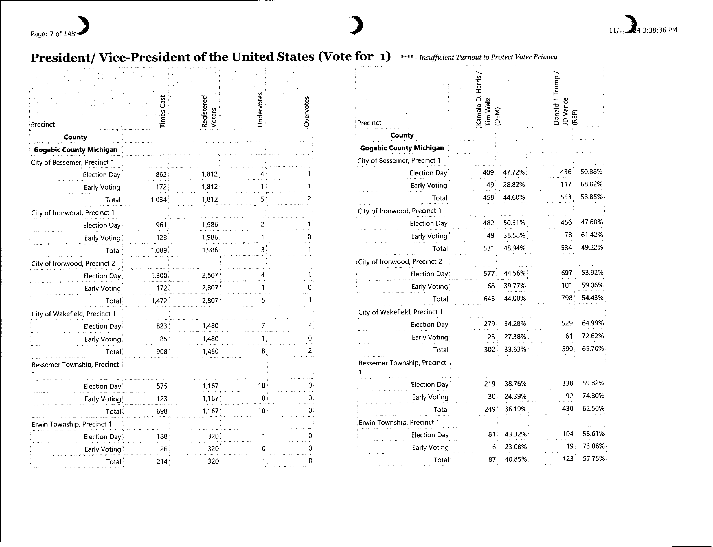
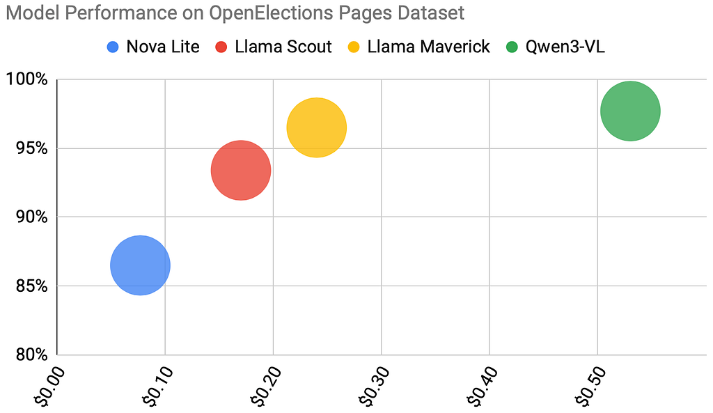
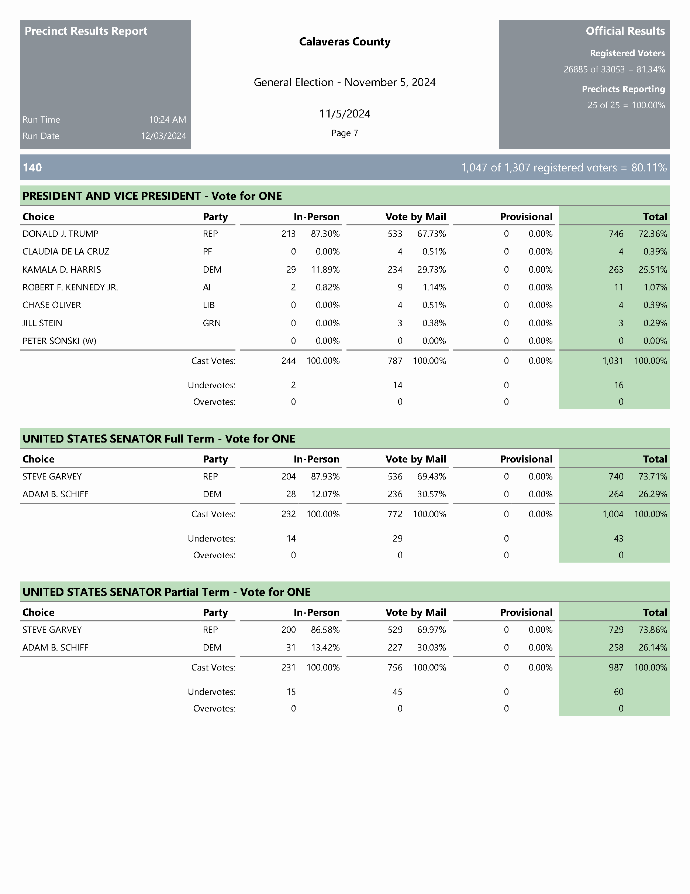
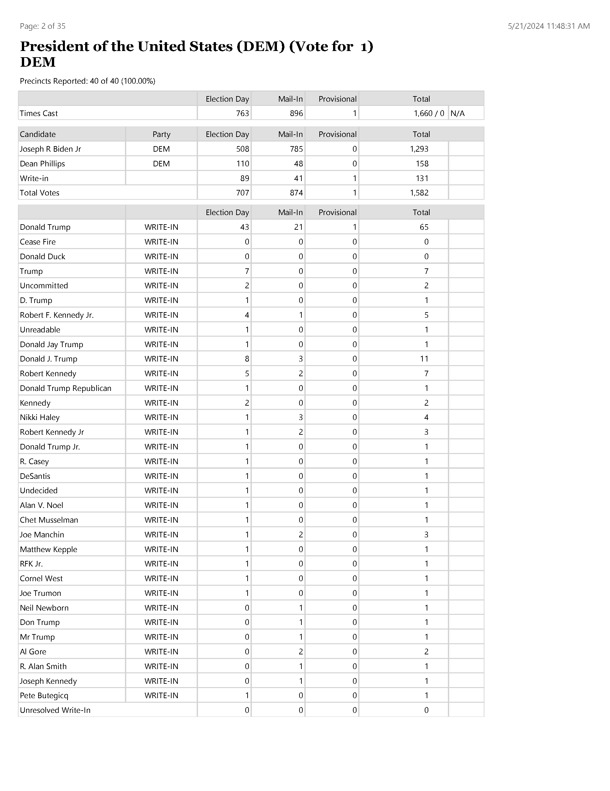
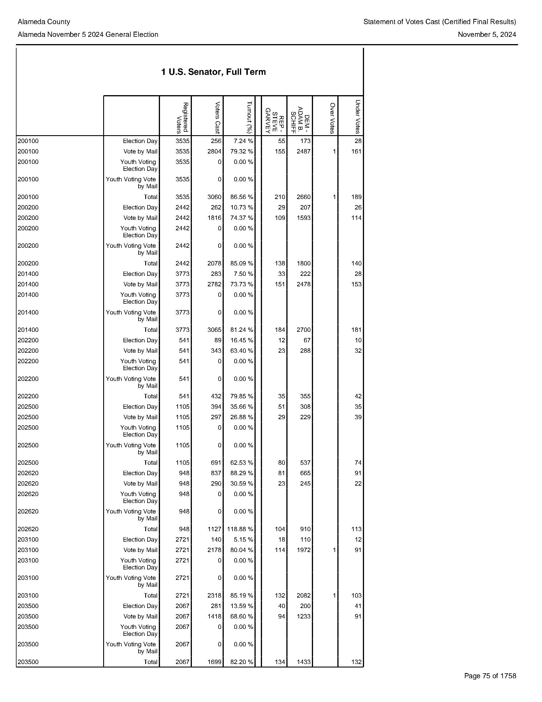
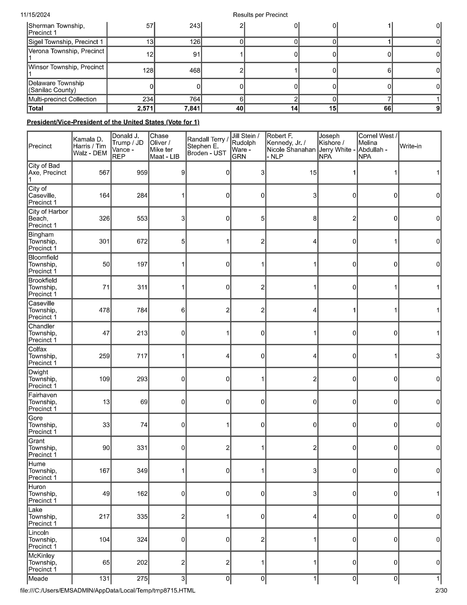
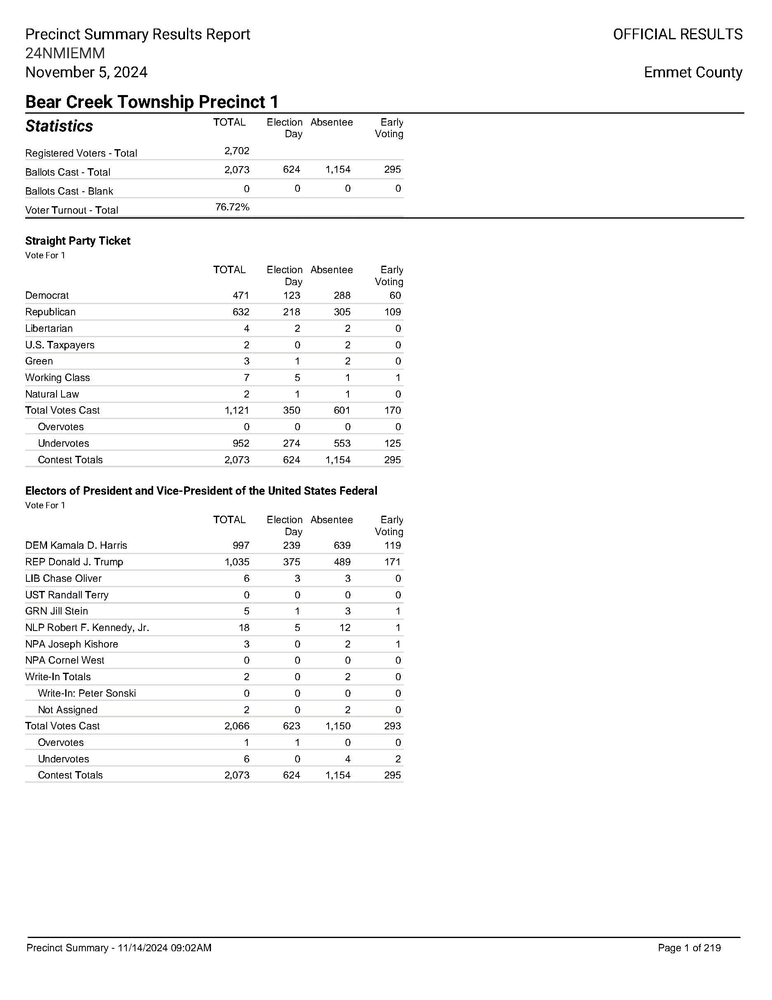
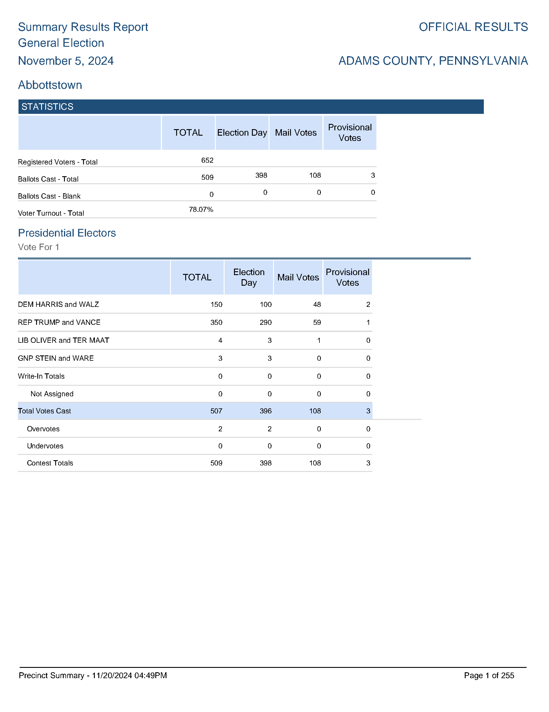
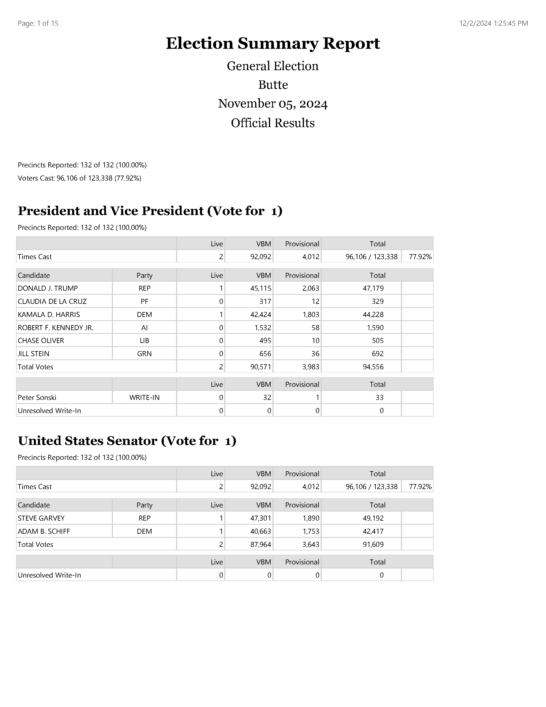
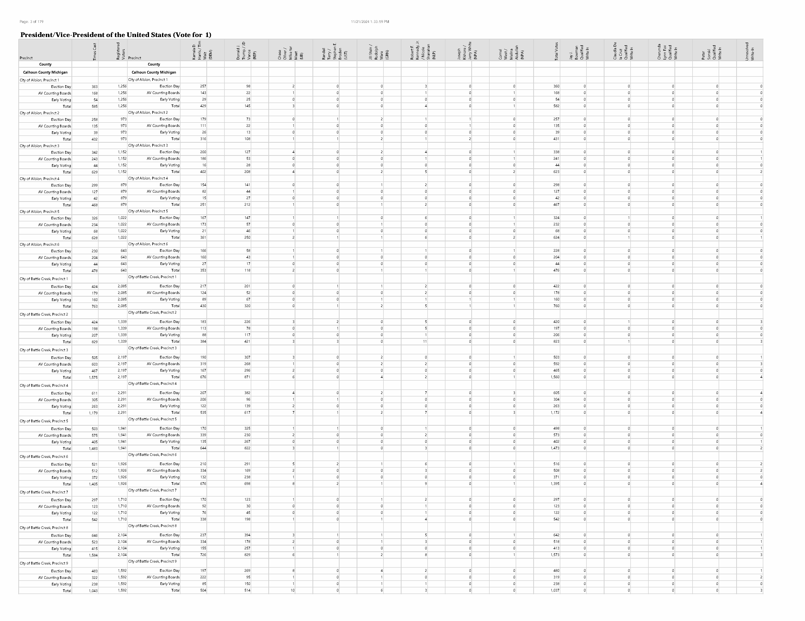

# Weeknotes, 2026W30: Feeding Elections Data To The Models

*Adapted from [https://medium.com/@michalmigurski/weeknotes-2026w30-feeding-elections-data-to-the-models-80594cc542b8](https://medium.com/@michalmigurski/weeknotes-2026w30-feeding-elections-data-to-the-models-80594cc542b8)*

After every U.S. general election, our more-than-3000 county election boards release
detailed per-precinct results data. This is the most geographically precise
privacy-preserving vote count data possible, vital for political scientists and
political campaigners alike. No central body governs how the data is released, so the
available formats span a wild range: spreadsheets if you’re lucky, spreadsheets exported
to PDFs with tables split over many dozens of pages if you’re unlucky, and bitmap scans
of printed PDFs when you’ve really lost the mandate of heaven.



*Gogebic County, MI includes this skewed, low-quality scan of a paper printout as part of its data release; fortunately this county also publishes a spreadsheet.*

In his [OpenElections project](https://openelections.net), journalist Derek Willis has
for years been turning major races from these releases into usable data in continuation
of an older Associated Press effort. He welcomes help via Github, and after the 2024
General I assisted with hard-to-parse [counties in Michigan](https://github.com/openelections/openelections-data-mi/pulls?q=is%3Apr+author%3Amigurski+)
and [Pennsylvania](https://github.com/openelections/openelections-data-pa/pulls?q=is%3Apr+author%3Amigurski+)
via a combination of writing code, paying for OCR services like Textract, and manually
editing spreadsheets. There’s always a long tail of difficult counties that take ages to
digitize. This November we’re doing it all again, and in the intervening years
[AI tools like DSPy have become more widely available](https://dspy.ai/). Let’s see if
they can help us!

An initial part of the OpenElections data problem depends on recognizing structural
features of pages, like the Gogebic County one above, as hints for table reconstruction.
Are contests or candidate names listed? Are there precinct-level vote counts? Do the
tables have headers? Does the page represent a single race with rows for precincts, or a
single precinct with groups of races and rows for candidates? Are the headers rotated by
90 degrees, and is the whole page skewed due to sloppy scanning? We can reconstruct
tables of data later, but first we have to quickly figure out what we’re dealing with. A
typical county PDF might have hundreds or even thousands of pages like the one above.
Even a non-scanned PDF can benefit from image analysis to reconstruct visual
organization from a stream of text entities.

This is the DSPy program I wrote to solve the problem of describing elections data pages:

```Python
class PageAnalysis(dspy.Signature):
    '''Report factual, in-page observations about ONE election-results page image.

    You are shown a single page image, not a whole document. Describe only what is
    visible on THIS page; do not infer contests or precincts that would be on other
    pages.
    '''
    image: dspy.Image = dspy.InputField(desc='A single rendered election-results page')
    candidate_orientation: typing.Literal['columns', 'rows'] = dspy.OutputField(
        desc="'columns' when each candidate/party is a column (and precincts run "
             "down the rows); 'rows' when each candidate/party is a row")
    contest_name_present: bool = dspy.OutputField(
        desc='Is a contest/office title visible on this page? A continuation page '
             'that just carries more candidate columns or more precinct rows often '
             'has none')
    candidate_names_present: bool = dspy.OutputField(
        desc='Are candidate or party names visible on this page? False on a bare '
             'data-only continuation page')
    headers_present: bool = dspy.OutputField(
        desc='Are column/row headers labeling the numbers present on this page?')
    precinct_scope: typing.Literal['multi_precinct', 'per_precinct', 'county'] = dspy.OutputField(
        desc="'multi_precinct' when the page lays out many precincts along an axis; "
             "'per_precinct' when the page is a single precinct named in a heading "
             "with its results below; 'county' when the page shows county-wide "
             "aggregates with no precinct dimension")
    precinct_orientation: typing.Literal['rows', 'columns', 'none'] = dspy.OutputField(
        desc="For a multi_precinct page, whether precincts are 'rows' or 'columns'; "
             "otherwise 'none'")
```

It’s Python but it’s mostly strings. DSPy is an interface to AI models that turns the
program above into useful input and output by mapping data types like booleans, strings,
or even images to LLM input and converting LLM output to meaningful Python types. The
“programming” of the program is the docstring and field descriptions explaining the
intended outputs. In DSPy most effort and time go into specifying the shapes of results,
evaluating the strengths and costs of AI models toward delivering those results, and
supplying training and evaluation datasets of examples that can be used to choose among
programs and models.

In some ways it’s easier to work in DSPy than traditional programming languages. DSPy
has a way of forcing edge cases and complicated scenarios to the foreground and making
those exceptions show up in eval results. However, I often find comfort in the details
and superficial progress of regular programming so DSPy’s do-what-I-mean approach can
feel incredibly uncomfortable at times. A joke slogan for DSPy goes “oh no, now I need
to know what I want”.

Most of the OpenElections work looked like that: stalking the outer edge of the dataset
to figure out what I wanted, breaking the larger problem into pieces, and building up
training data to prove it was working as expected. Training data is a collection of
example inputs with hand-labeled reference outputs matching the fields in the program,
in this case a directory of image files with my own human judgement calls about correct
values for each of the outputs. Interactively using Claude Code at this stage helps
reduce labeling tedium a great deal. Claude’s models can interpret images (they’re
“multimodal”) and given a few starting examples can generalize to a wider set. I labeled
a few dozen documents and Claude followed my directions to expand those labels to more
than 70 example pages.

## Why not just have Claude Opus do the whole thing?

For many engineers, Claude’s Opus model is “the good one.” At small scales Opus is
effective but it gets expensive fast: AWS Bedrock charges $5 per million input tokens.
The predictions I’ve been making for these pages cost ~5k tokens apiece. $25 for 1,000
pages looks like real money given how long some of these documents get. DSPy-using
companies like Dropbox and Shopify cite the same motivation in their presentations: a
premium model can give high-quality answers with confidence, but having a lower yet
*still known* level of confidence faster and cheaper might be just as valuable.
[Drew Breunig describes the related problem of prompt debt](https://www.dbreunig.com/2026/06/22/the-problem-is-prompt-debt.html)
arising from uncertainty about the abilities of unfamiliar models. People don’t want to
risk using a worse model they don’t know how to control.

## How can you know if a less-powerful model is good enough?

There are plenty of cheaper models in catalogs like Bedrock but choosing among them gets
into a zoo of options with new releases all the time: “Qwen,” “Llama,” “Kimi,” and other
obscure-sounding models can cost as little as 1/100th of Opus per token but how can you
know if they’ll work for you? This is where investing time in a DSPy training dataset
gets interesting: with my directory of images and expected outputs, I could re-point
DSPy at one model after another to understand their capabilities.



I chose four multimodal models ranging from the $0.08/million Nova Lite to the
$0.53/million Qwen 3, all already 1/10th the cost of Opus. The result curve above shows
a clean performance/cost trade-off: Qwen 3 reaches 98% accuracy, Llama Maverick 97% for
lower cost. Down at the bottom Nova Lite reaches only 87% accuracy but it’s *fast* so
maybe worth using in certain scenarios? If we were to break the output fields down a
little, Nova Lite is strong enough to determine whether headers are present and how
precincts are organized 95% of the time while Maverick is only weak in the areas of
precinct scope and guessing if candidate names are present:

Nova Lite ($0.08/1M)

```
candidate_orientation    64/74 = 86%
precinct_scope           63/74 = 85%
contest_name_present     67/74 = 91%
candidate_names_present  51/74 = 69%
headers_present          70/74 = 95%  ✔
precinct_orientation     70/74 = 95%  ✔
```

Llama Scout ($0.17/1M)

```
candidate_orientation    66/74 = 89%
precinct_scope           69/74 = 93%
contest_name_present     74/74 = 100% ✔
candidate_names_present  67/74 = 91%
headers_present          72/74 = 97%  ✔
precinct_orientation     73/74 = 99%  ✔
```

Llama Maverick ($0.24/1M)

```
candidate_orientation    73/74 = 99%  ✔
precinct_scope           68/74 = 92% 
contest_name_present     74/74 = 100% ✔
candidate_names_present  69/74 = 93% 
headers_present          72/74 = 97%  ✔
precinct_orientation     73/74 = 99%  ✔
```

Qwen3-VL ($0.53/1M)

```
candidate_orientation    72/74 = 97%  ✔
precinct_scope           72/74 = 97%  ✔
contest_name_present     74/74 = 100% ✔
candidate_names_present  71/74 = 96%  ✔
headers_present          72/74 = 97%  ✔
precinct_orientation     74/74 = 100% ✔
```

## Can the program be improved?

DSPy offers another level of power called optimization, via a tool called [GEPA](https://gepa-ai.github.io/gepa/)
that pairs your program with a high-powered “teacher” model. Over a few hundred
requests, a powerful and expensive teacher like Opus can review the performance of small
and cheap student models like Scout or Maverick and propose better prompt language to
improve their accuracy.

For this specific program, my results were mostly driven by the underlying capabilities
of the models and not the sophistication of my prompts. I imagine feeding known contests
and candidate names to Nova Lite could improve its ability to recognize whether such
names are present instead of guessing without context. Optimizing my program did not
yield a better one, but it did usefully tell me that there’s not a prompt-level
improvement to be had for this case.

## Next(ish) steps

Just recognizing page types is a small part of consuming sources for OpenElections. Next
time I’ll talk about overall document structure and extracting specific electoral
contests.

# Appendix: Example Pages

Sourced from:

- [https://github.com/openelections/openelections-sources-ca](https://github.com/openelections/openelections-sources-ca)
- [https://github.com/openelections/openelections-sources-mi](https://github.com/openelections/openelections-sources-mi)
- [https://github.com/openelections/openelections-sources-pa](https://github.com/openelections/openelections-sources-pa)


*Calaveras County, CA — rows, per-precinct*

 |
*Bedford County, PA — rows, county summary*


*Alameda County, CA — columns, multi-precinct*

 |
*Huron County, MI — columns, multi-precinct*


*Emmet County, MI — rows, per-precinct*

 |
*Adams County, PA — rows, per-precinct*


*Butte County, CA — rows, county summary*

 |
*Calhoun County, MI — columns, multi-precinct*
